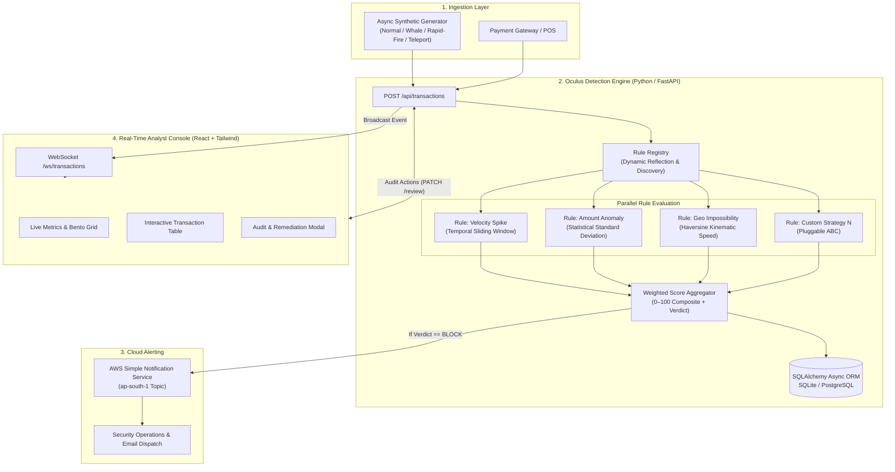

<div align="center">

# 🛡️ OCULUS // SentinelPay
### Enterprise Real-Time Fraud Rule Engine & Human-in-the-Loop Review Console

[](https://www.python.org/)
[](https://fastapi.tiangolo.com/)
[](https://react.dev/)
[](https://tailwindcss.com/)
[](https://aws.amazon.com/sns/)
[](LICENSE)

*An asynchronous, sub-millisecond fraud scoring engine and operational review console modeled after Stripe Radar and PayPal's multi-layered defense architecture.*

[Architecture](#-system-architecture) • [Design Principles](#-core-design-principles) • [Rule Pipeline](#-fraud-detection-rules) • [Review Console](#-analyst-review-console) • [AWS SNS Integration](#-aws-sns-cloud-alerting) • [Quickstart](#-quickstart-guide) • [API Specs](#-api-specification)

</div>

---

## 📌 Executive Summary

Modern fintech payment processors must intercept sophisticated fraud attempts in under **50ms** without inducing friction on legitimate customers. **Oculus** implements an enterprise-grade, asynchronous fraud detection pipeline that reconciles deterministic rules, temporal profiling, kinematic analysis, and real-time cloud alerting into a unified human-in-the-loop console.

### Key Capabilities
- **Open/Closed Plugin Registry:** Drop new detection strategies into `backend/rules/` without modifying core engine logic or restarting pipelines.
- **Continuous 0–100 Risk Scoring:** Multi-factor weighted composite scoring model inspired by Stripe Radar (replacing naive binary flag gates).
- **Three-Tier Verdict Resolution:** Deterministic classification into `ALLOW` (<40), `REVIEW` (40–74), and `BLOCK` (≥75).
- **Asynchronous Event Ingestion & Streaming:** Built on FastAPI and WebSockets, dispatching state changes to connected analysts in real time.
- **Automated AWS SNS Alerting:** Critical risk thresholds trigger cloud notification dispatches to compliance teams with rich contextual payloads.
- **Sleek Analyst Console:** High-density, minimal dark-mode interface built with React 18, Tailwind CSS v4, and Lucide Icons following Linear/Vercel design aesthetics.

---

## 🏛️ System Architecture



---

## 🧠 Core Design Principles

### 1. Open/Closed Principle (OCP)
The core detection engine does not contain hard-coded business logic or rules. All rules implement the `FraudRule` Abstract Base Class (ABC). At application startup, the `RuleRegistry` dynamically scans the `rules/` package using Python `importlib` and `pkgutil` reflection, automatically registering any subclasses.

```python
# backend/engine/base.py
class FraudRule(ABC):
    @property
    @abstractmethod
    def name(self) -> str: ...

    @property
    @abstractmethod
    def weight(self) -> float: ...

    @abstractmethod
    async def evaluate(self, transaction: dict, history: list[dict]) -> RuleResult: ...
```

### 2. Multi-Signal Composite Risk Aggregation
Instead of simplistic boolean flags, each rule yields a normalized score $S_i \in [0, 100]$ alongside human-readable explanations. The composite risk score $R$ is formulated as a normalized weighted sum:

$$R = \frac{\sum_{i=1}^{N} (S_i \times W_i)}{\sum_{i=1}^{N} W_i}$$

| Composite Score ($R$) | Verdict | Policy Action |
|:---|:---:|:---|
| $0 \le R < 40$ | `ALLOW` | Auto-approved; processed without human intervention. |
| $40 \le R < 75$ | `REVIEW` | Routed to Analyst Console for manual investigation. |
| $75 \le R \le 100$ | `BLOCK` | Transaction immediately halted; AWS SNS alert triggered. |

---

## 🔍 Fraud Detection Rules

| Rule Identifier | Weight | Detection Strategy | Mathematical / Algorithmic Basis |
|:---|:---:|:---|:---|
| **`velocity_check`** | 35% | High-frequency burst detection | Tracks transaction counts within a dynamic sliding temporal window ($t \le 300\text{s}$). Scores escalate aggressively when surpassing $N > 5$ transactions. |
| **`amount_anomaly`** | 35% | Z-Score outlier detection | Computes the running historical sample mean $\mu$ and standard deviation $\sigma$. Flags transactions where deviation $Z = \frac{X - \mu}{\sigma} > 2.0$. |
| **`geo_impossible`** | 30% | Kinematic impossibility (Teleportation) | Computes great-circle distance between successive transaction coordinates via the **Haversine Formula**: <br/> $d = 2r \arcsin\left(\sqrt{\sin^2(\frac{\Delta \phi}{2}) + \cos \phi_1 \cos \phi_2 \sin^2(\frac{\Delta \lambda}{2})}\right)$ <br/> Flags velocities exceeding commercial aviation limits ($v > 900\text{ km/h}$). |

---

## 🔌 Adding a New Rule in 60 Seconds

To add a new rule (e.g., Device Fingerprint Switching), simply create a new file in `backend/rules/`:

```python
# backend/rules/device_switch.py
from engine.base import FraudRule, RuleResult
from typing import Dict, List

class DeviceSwitchRule(FraudRule):
    @property
    def name(self) -> str:
        return "device_switch"

    @property
    def weight(self) -> float:
        return 0.25

    async def evaluate(self, transaction: Dict, history: List[Dict]) -> RuleResult:
        current_device = transaction.get("device_fingerprint")
        historical_devices = {h.get("device_fingerprint") for h in history if h.get("device_fingerprint")}
        
        if historical_devices and current_device not in historical_devices:
            return RuleResult(
                rule_name=self.name,
                score=65.0,
                reason=f"New device fingerprint detected. Previous devices: {len(historical_devices)}",
                triggered=True
            )
        return RuleResult(self.name, 0.0, "Recognized device profile", False)
```

**Zero changes required in `engine/core.py` or `main.py`.** The engine automatically registers the rule on startup.

---

## 🖥️ Analyst Review Console

The frontend is an ultra-fast, minimal dark-mode web console designed for security operations and fraud analysts.

- **Design System:** Engineered with Tailwind CSS v4, custom glassmorphism layers (`bg-white/5 backdrop-blur-sm`), and Inter typography.
- **Zero Heavy Component Overhead:** Bundle size reduced to just **247 KB** (83% reduction from traditional component libraries).
- **Pure SVG Risk Gauge:** Real-time animated circular gauge visualizing the continuous 0–100 risk score and verdict state.
- **Live Stream Socket:** Subscribes to the backend WebSocket pipeline with exponential backoff auto-reconnection.
- **Audit Remediation:** One-click review actions (`Mark as Cleared`, `Confirm Fraud`) with audit trail notes committed to persistent storage.

---

## ☁️ AWS SNS Cloud Alerting

When a transaction triggers a `BLOCK` verdict, Oculus immediately formats a high-priority incident payload and dispatches it through AWS SNS.

### Automated Setup
```bash
python3 scripts/setup_sns.py --email analyst-team@company.com --region ap-south-1
```

### Alert Payload Sample
```text
FRAUD ALERT: Blocked transaction ff936e48-e391-4b5c-bc0d-c31830a3e184
Amount: $50,000.00 USD
Sender: user_14
Score: 82.5 (BLOCK)
Triggered Rules:
 - amount_anomaly: Amount is 6.4x standard deviation above mean (score: 85.0)
 - geo_impossibility: Impossible speed: 3,995,740 km/h (score: 100.0)
```

*Note: In local or offline environments where AWS credentials are omitted, the system seamlessly activates the `ConsoleNotifier` fallback without crashing.*

---

## 🚀 Quickstart Guide

### Prerequisites
- Python 3.10+
- Node.js 18+ and npm
- AWS CLI configured (optional for live SNS notifications)

### 1. Clone the Repository
```bash
git clone git@github.com:Kabe-Innovates/oculus.git
cd oculus
```

### 2. Backend Setup
```bash
cd backend
python3 -m venv venv
source venv/bin/activate
pip install -r requirements.txt
cp .env.example .env

# Start FastAPI server on port 8000
uvicorn main:app --reload --host 0.0.0.0 --port 8000
```
*API documentation and interactive OpenAPI Swagger UI available at: `http://localhost:8000/docs`*

### 3. Frontend Setup
```bash
# In a new terminal
cd frontend
npm install
npm run dev
```
*Access the Review Console at: `http://localhost:5173`*

### 4. Running the Ingestion Simulator
You can toggle the transaction stream directly from the Review Console via the **"Start Simulator"** button, or via cURL:
```bash
# Start transaction streaming
curl -X POST http://localhost:8000/api/simulate/start

# Check simulator status
curl http://localhost:8000/api/simulate/status

# Stop transaction streaming
curl -X POST http://localhost:8000/api/simulate/stop
```

---

## 📑 API Specification

| Method | Endpoint | Description |
|:---|:---|:---|
| `POST` | `/api/transactions` | Ingests a new transaction, executes rules, and persists audit state. |
| `GET` | `/api/transactions` | Query filtered transactions (`?verdict=BLOCK&status=PENDING&limit=50`). |
| `GET` | `/api/transactions/{id}` | Fetches individual transaction record with per-rule breakdown breakdown. |
| `PATCH` | `/api/transactions/{id}/review` | Updates review status (`CLEARED`, `CONFIRMED_FRAUD`) with notes. |
| `GET` | `/api/stats` | Returns real-time aggregate risk distributions and verdict counters. |
| `POST` | `/api/simulate/start` | Starts the async synthetic transaction generator. |
| `POST` | `/api/simulate/stop` | Terminates the async synthetic transaction generator. |
| `WS` | `/ws/transactions` | Bidirectional WebSocket stream broadcasting real-time events. |

---

## 📂 Repository Structure

```
oculus/
├── README.md                           # Enterprise System Documentation
├── .gitignore                          # Production Git Exclusion Filters
├── scripts/
│   └── setup_sns.py                    # Automated AWS SNS provisioning script
├── backend/                            # FastAPI Asynchronous Service
│   ├── main.py                         # Application lifecycle & WebSocket manager
│   ├── config.py                       # Pydantic Settings & environment schemas
│   ├── database.py                     # SQLAlchemy 2.0 Async Session factory
│   ├── models.py                       # Transaction ORM entities
│   ├── schemas.py                      # Request/Response validation schemas
│   ├── requirements.txt                # Production dependency tree
│   ├── engine/
│   │   ├── base.py                     # FraudRule Abstract Base Class & RuleResult
│   │   ├── registry.py                 # Dynamic reflection rule auto-discovery
│   │   └── core.py                     # Orchestrator & weighted aggregation engine
│   ├── rules/                          # Self-contained detection rule plugins
│   │   ├── velocity.py                 # Temporal burst evaluation rule
│   │   ├── amount_anomaly.py           # Gaussian outlier deviation rule
│   │   └── geo_impossible.py           # Haversine geodesic velocity rule
│   ├── services/
│   │   ├── notifier.py                 # Abstract notifier (AWS SNS & Console fallback)
│   │   └── simulator.py                # Synthetic transaction stream generator
│   └── routers/
│       ├── transactions.py             # Transaction ingestion and audit endpoints
│       ├── stats.py                    # Risk analytics and telemetry
│       └── simulator.py                # Streaming control endpoints
└── frontend/                           # React 18 + Vite + Tailwind Console
    ├── index.html                      # HTML5 entry with Inter font link
    ├── vite.config.js                  # Vite bundler configuration
    ├── package.json                    # Frontend dependencies
    └── src/
        ├── main.jsx                    # React virtual DOM entry
        ├── App.jsx                     # Router definitions
        ├── index.css                   # Tailwind v4 configuration & theme tokens
        ├── api/
        │   └── client.js               # Axios HTTP client
        ├── hooks/
        │   └── useTransactionStream.js # Resilient WebSocket hook
        ├── pages/
        │   ├── Dashboard.jsx           # Real-time monitoring dashboard
        │   └── TransactionDetail.jsx   # In-depth forensic investigation view
        └── components/
            ├── FilterBar.jsx           # Multi-predicate transaction filters
            ├── LiveIndicator.jsx       # WebSocket connectivity pulse
            ├── ReviewActions.jsx       # Remediation & analyst disposition
            ├── RiskGauge.jsx           # Animated SVG composite risk meter
            ├── RuleBreakdown.jsx       # Forensic rule contribution breakdown
            ├── StatsCards.jsx          # Real-time metrics grid
            ├── StatusBadge.jsx         # Lifecycle state pill tag
            ├── TransactionTable.jsx    # Virtualized transaction feed
            └── VerdictBadge.jsx        # Semantic verdict badge
```

---

## 🔒 Security & Reliability Considerations

1. **Fail-Open vs. Fail-Safe:** Engine execution traps rule-level exceptions within individual tasks, preventing unhandled exceptions in custom rules from failing legitimate payment ingestion.
2. **Credential Sanitization:** Environment files (`.env`) and local SQLite database files are strictly excluded from source control.
3. **Stateless Scalability:** The engine core is decoupled from transport and storage layers, ready for multi-worker containerization via Docker / Kubernetes.

---

## 📄 License

This project is licensed under the MIT License — see the [LICENSE](LICENSE) file for details.
