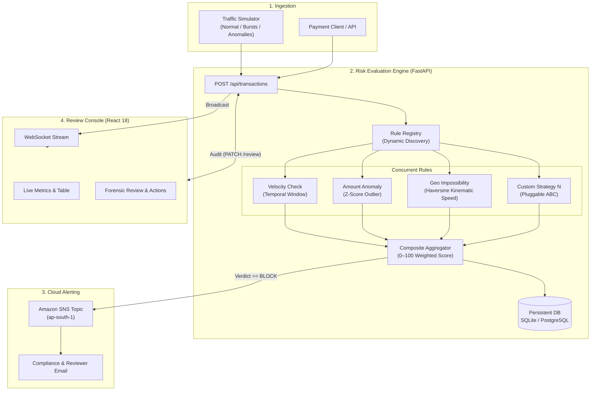

<div align="center">

# Oculus

### Real-Time Transaction Risk Engine & Review Console

[](https://python.org)
[](https://fastapi.tiangolo.com)
[](https://react.dev)
[](https://tailwindcss.com)
[](https://aws.amazon.com)
[](https://docker.com)
[](http://3.109.200.180/)

**[Live Review Console](http://3.109.200.180/)** • **[Interactive API Documentation](http://3.109.200.180/docs)** • **[GitHub Repository](https://github.com/Kabe-Innovates/oculus)**

</div>

---

## Overview

Oculus is a real-time fraud risk engine and analyst review console built for payment workflows. Modeled after defense-in-depth architectures used by Stripe Radar and PayPal, it evaluates transactions in under 50ms using an open/closed rule engine, streaming verdicts to an operational review dashboard and dispatching cloud alerts via Amazon SNS.

### Highlights
- **Open/Closed Rule Engine**: Add new rules without modifying core engine logic.
- **Continuous 0–100 Scoring**: Weighted composite risk scores instead of binary flags.
- **Three-Tier Policy**: Automatic classification into `ALLOW` (<40), `REVIEW` (40–74), and `BLOCK` (≥75).
- **Amazon SNS Integration**: Real-time email notifications for critical blocked transactions.
- **Real-Time Console**: Minimal dark-mode dashboard built with React 18, Tailwind CSS v4, and WebSockets.
- **Live AWS Cloud Host**: Containerized and running on AWS EC2 behind an Nginx reverse proxy.

---

## Live Endpoints

- **Analyst Console**: [http://3.109.200.180/](http://3.109.200.180/)
- **API Documentation**: [http://3.109.200.180/docs](http://3.109.200.180/docs)
- **WebSocket Stream**: `ws://3.109.200.180/ws/transactions`
- **AWS Region**: `ap-south-1` (Mumbai)

---

## System Architecture



---

## Detection Rules

| Rule | Weight | Method | Logic |
|:---|:---:|:---|:---|
| **Velocity Spike** (`velocity_check`) | 35% | Temporal Sliding Window | Flags accounts exceeding 5 transactions within a 300-second window to detect automated card-testing. |
| **Amount Anomaly** (`amount_anomaly`) | 35% | Gaussian Z-Score | Calculates sample mean $\mu$ and standard deviation $\sigma$ from sender history; flags transactions where $Z > 2.0$. |
| **Geo Impossibility** (`geo_impossible`) | 30% | Haversine Kinematic Distance | Computes great-circle distance between consecutive locations; flags Relocations requiring speeds $> 900\text{ km/h}$. |

### Composite Risk Formulation

Each rule produces an individual score $S_i \in [0, 100]$. The engine aggregates these into a normalized composite score $R$:

$$R = \frac{\sum_{i=1}^{N} (S_i \times W_i)}{\sum_{i=1}^{N} W_i}$$

| Score Range | Verdict | Action |
|:---:|:---:|:---|
| $0 \le R < 40$ | `ALLOW` | Transaction approved automatically. |
| $40 \le R < 75$ | `REVIEW` | Routed to analyst console for inspection. |
| $75 \le R \le 100$ | `BLOCK` | Transaction halted; Amazon SNS alert dispatched. |

---

## Extensibility: Adding a Rule

Create a new file in `backend/rules/` inheriting `FraudRule`. The system registers it on startup without engine modifications:

```python
# backend/rules/device_switch.py
from engine.base import FraudRule, RuleResult
from typing import Dict, List

class DeviceSwitchRule(FraudRule):
    @property
    def name(self) -> str:
        return "device_switch"

    @property
    def weight(self) -> float:
        return 0.25

    async def evaluate(self, transaction: Dict, history: List[Dict]) -> RuleResult:
        device_id = transaction.get("device_fingerprint")
        known = {h.get("device_fingerprint") for h in history if h.get("device_fingerprint")}

        if known and device_id not in known:
            return RuleResult(
                rule_name=self.name,
                score=65.0,
                reason=f"New device fingerprint detected. Known devices: {len(known)}",
                triggered=True
            )
        return RuleResult(self.name, 0.0, "Recognized device profile", False)
```

---

## Amazon SNS Notifications

When an incident triggers a `BLOCK` verdict, an alert payload is dispatched to Amazon SNS:

```text
FRAUD ALERT: Blocked transaction ff936e48-e391-4b5c-bc0d-c31830a3e184
Amount: $50,000.00 USD
Sender: user_14
Score: 82.5 (BLOCK)
Triggered Rules:
 - amount_anomaly: Amount is 6.4x standard deviation above mean (score: 85.0)
 - geo_impossibility: Impossible speed: 3,995,740 km/h (score: 100.0)
```

If AWS credentials are not configured, the system gracefully falls back to console logging.

---

## Quickstart

### Local Setup with Docker Compose
```bash
git clone https://github.com/Kabe-Innovates/oculus.git
cd oculus
docker compose up -d --build
```
The console will be accessible at `http://localhost/` and API docs at `http://localhost/docs`.

### Manual Setup
```bash
# 1. Backend
cd backend
python3 -m venv venv
source venv/bin/activate
pip install -r requirements.txt
cp .env.example .env
uvicorn main:app --reload --port 8000

# 2. Frontend (in another terminal)
cd frontend
npm install
npm run dev
```

---

## API Reference

| Method | Endpoint | Description |
|:---|:---|:---|
| `POST` | `/api/transactions` | Ingest and evaluate a new transaction. |
| `GET` | `/api/transactions` | List evaluated transactions (`?verdict=BLOCK&status=PENDING`). |
| `GET` | `/api/transactions/{id}` | Retrieve transaction detail and per-rule breakdown. |
| `PATCH` | `/api/transactions/{id}/review` | Adjudicate transaction (`CLEARED`, `CONFIRMED_FRAUD`). |
| `GET` | `/api/stats` | Retrieve aggregate risk distribution and counters. |
| `POST` | `/api/simulate/start` | Start synthetic transaction generator. |
| `POST` | `/api/simulate/stop` | Stop synthetic transaction generator. |
| `WS` | `/ws/transactions` | Real-time WebSocket transaction stream. |

---

## License

This project is licensed under the MIT License. See [LICENSE](LICENSE) for details.
