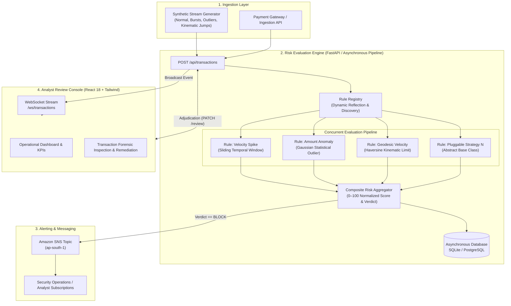

# Oculus Fraud Detection Platform

### Real-Time Transaction Risk Evaluation Engine and Review Console

---

## Executive Summary

The Oculus Fraud Detection Platform provides real-time transaction scoring, automated risk mitigation, and human-in-the-loop review capabilities for mission-critical financial infrastructure. Modeled after defense-in-depth principles employed by global payment processors, the system evaluates incoming transaction streams with sub-50ms latency using an extensible, multi-factor rule engine.

Transactions undergo concurrent evaluation across temporal velocity, statistical outlier detection, and geodesic kinematic consistency. High-risk anomalies trigger automated mitigation workflows, including cloud-based security notifications via Amazon Simple Notification Service (Amazon SNS), while routing borderline events to a high-density analyst console for human adjudication.

---

## Key System Capabilities

- **Open/Closed Plugin Architecture**: Detection strategies implement an abstract base interface and are registered at runtime via dynamic package reflection. New rules can be deployed without altering the engine orchestrator or interrupting active ingestion streams.
- **Continuous Normalized Risk Scoring**: Transactions receive a composite risk score ranging from 0 to 100 based on normalized weighted scoring algorithms, avoiding brittle binary classification.
- **Three-Tier Policy Enforcement**: Deterministic policy assignment categorizes events into `ALLOW` (0–39), `REVIEW` (40–74), and `BLOCK` (75–100).
- **Asynchronous Ingestion and WebSocket Broadcast**: Built on modern asynchronous Python (FastAPI/asyncio) and WebSockets to deliver immediate state replication across all connected operational consoles.
- **Cloud Notification Integration**: High-risk events trigger automated dispatch through Amazon SNS, notifying compliance and fraud investigation personnel via email or automated webhooks.
- **Optimized Operational Console**: A high-performance, dark-mode analyst interface built with React 18 and Tailwind CSS, featuring SVG telemetry meters, granular rule audit breakdowns, and complete audit logging.

---

## System Architecture



---

## Architectural Principles

### Open/Closed Principle

The evaluation engine adheres strictly to the Open/Closed Principle (software entities should be open for extension, but closed for modification). All detection rules inherit from the `FraudRule` abstract base class:

```python
from abc import ABC, abstractmethod
from dataclasses import dataclass

@dataclass
class RuleResult:
    rule_name: str
    score: float
    reason: str
    triggered: bool

class FraudRule(ABC):
    @property
    @abstractmethod
    def name(self) -> str:
        """Unique identifier for the detection rule."""
        pass

    @property
    @abstractmethod
    def weight(self) -> float:
        """Relative contribution weight (0.0 to 1.0) in composite scoring."""
        pass

    @abstractmethod
    async def evaluate(self, transaction: dict, history: list[dict]) -> RuleResult:
        """Asynchronously evaluate the transaction against historical context."""
        pass
```

During application initialization, the `RuleRegistry` inspects the `backend/rules/` directory via `importlib` and `pkgutil`, automatically instantiating all concrete implementations without requiring manual wiring.

### Multi-Factor Composite Scoring Model

Rather than relying on isolated threshold gates, each detection rule yields a normalized score $S_i \in [0, 100]$ alongside explanatory metadata. The engine aggregates these scores into a single composite index $R$:

$$R = \frac{\sum_{i=1}^{N} (S_i \times W_i)}{\sum_{i=1}^{N} W_i}$$

Where $W_i$ represents the assigned weight of rule $i$.

| Composite Score ($R$) | Verdict | Automated Action |
|:---|:---:|:---|
| $0 \le R < 40$ | `ALLOW` | Auto-cleared. Transaction proceeds without analyst intervention. |
| $40 \le R < 75$ | `REVIEW` | Flagged. Routed to analyst console for secondary review. |
| $75 \le R \le 100$ | `BLOCK` | Halted. Transaction blocked; immediate Amazon SNS alert dispatched. |

---

## Detection Rule Specifications

### 1. Velocity Spike (`velocity_check`)
- **Objective**: Prevent card-testing attacks and rapid credential stuffing.
- **Mechanism**: Inspects the sender's transaction count within a sliding temporal window of 300 seconds.
- **Scoring**: Scaled linearly relative to the configured threshold $T$ ($T=5$ transactions). If count $C > T$, score escalates up to 100; otherwise, partial risk is assigned proportionally.

### 2. Amount Anomaly (`amount_anomaly`)
- **Objective**: Detect uncharacteristic spending deviations indicative of account takeover or unauthorized access.
- **Mechanism**: Computes the historical sample mean $\mu$ and standard deviation $\sigma$ across the sender's prior transactions.
- **Scoring**: Computes the standard score $Z = \frac{X - \mu}{\sigma}$. Transactions with $Z > 2.0$ trigger an anomaly flag, scaling the risk score relative to the magnitude of the deviation.

### 3. Geodesic Velocity (`geo_impossibility`)
- **Objective**: Detect impossible geographical relocation between consecutive transactions (teleportation fraud).
- **Mechanism**: Extracts latitude and longitude from consecutive transactions and applies the Haversine formula to compute great-circle distance $d$:

$$d = 2r \arcsin\left(\sqrt{\sin^2\left(\frac{\Delta \phi}{2}\right) + \cos(\phi_1)\cos(\phi_2)\sin^2\left(\frac{\Delta \lambda}{2}\right)}\right)$$

- **Scoring**: Calculates minimum required travel speed $v = \frac{d}{\Delta t}$. If $v > 900\text{ km/h}$ (standard commercial aviation velocity limit), an impossible travel condition is flagged with a score of 100.

---

## Extension Guide: Adding Custom Rules

To introduce a new rule, add a single Python file to `backend/rules/`. No modifications to engine orchestrators or API routers are necessary.

```python
# backend/rules/device_reputation.py
from engine.base import FraudRule, RuleResult
from typing import Dict, List

class DeviceReputationRule(FraudRule):
    @property
    def name(self) -> str:
        return "device_reputation"

    @property
    def weight(self) -> float:
        return 0.25

    async def evaluate(self, transaction: Dict, history: List[Dict]) -> RuleResult:
        device_id = transaction.get("device_fingerprint")
        known_devices = {h.get("device_fingerprint") for h in history if h.get("device_fingerprint")}

        if known_devices and device_id not in known_devices:
            return RuleResult(
                rule_name=self.name,
                score=60.0,
                reason=f"Unrecognized device fingerprint. Known profiles: {len(known_devices)}",
                triggered=True
            )

        return RuleResult(self.name, 0.0, "Recognized device profile", False)
```

The system will discover and register the rule automatically upon the next service cycle.

---

## Cloud Integration: Amazon SNS

The notification subsystem provides critical alerting when high-risk thresholds are crossed:

1. **Service Provisioning**: Automated topic generation and subscriber management using `scripts/setup_sns.py`.
2. **Alert Payloads**: Dispatches formatted incident reports containing transaction identifiers, amounts, sender information, composite risk ratings, and detailed rule justifications.
3. **Graceful Fallback**: If AWS credentials or topic ARNs are omitted in local environments, the platform routes alerts through `ConsoleNotifier` without throwing unhandled exceptions.

### Alert Message Format
```text
FRAUD ALERT: Blocked transaction 6e67ee0e-4b7c-4ea9-ad2f-92517fa9f075
Amount: 50,000.00 USD
Sender: user_1
Score: 82.5 (BLOCK)
Triggered Rules:
 - amount_anomaly: Amount significantly higher than historical average (Score: 80.0)
 - geo_impossibility: Impossible speed: 3,995,740 km/h (Score: 100.0)
```

---

## Operational Console (Frontend)

The user interface is engineered for real-time monitoring and forensic analysis:

- **Minimalist Aesthetic**: High-contrast, dark-mode design optimized for operations centers.
- **Lightweight Footprint**: Bundle size of 247 KB, built with standard Vite and React 18 pipelines.
- **WebSocket State Synchronization**: Automatic subscription to the backend transaction stream with exponential backoff reconnection handling.
- **Telemetry Visualizations**: SVG-based risk meters and dynamic progress indicators reflecting risk distributions.
- **Audit Workflow**: Analysts can clear transactions or confirm fraud, appending reviewer notes to the audit ledger.

---

## Getting Started

### Prerequisites
- Python 3.10 or higher
- Node.js 18 or higher (with npm)
- AWS CLI configured (optional; required only for live Amazon SNS dispatches)

### 1. Installation

Clone the repository:
```bash
git clone git@github.com:Kabe-Innovates/oculus.git
cd oculus
```

### 2. Backend Initialization

```bash
cd backend
python3 -m venv venv
source venv/bin/activate
pip install -r requirements.txt
cp .env.example .env

# Start FastAPI service
uvicorn main:app --reload --host 0.0.0.0 --port 8000
```

The interactive OpenAPI documentation is accessible at `http://localhost:8000/docs`.

### 3. Frontend Initialization

```bash
# In a separate terminal session
cd frontend
npm install
npm run dev
```

The review console will be available at `http://localhost:5173`.

### 4. Amazon SNS Configuration (Optional)

To configure live email notifications for blocked transactions:

```bash
cd backend
./venv/bin/python ../scripts/setup_sns.py --email analyst@example.com --region ap-south-1
```

Confirm the subscription link received in the target email inbox, then restart the backend service.

---

## API Reference

| HTTP Method | Route | Description |
|:---|:---|:---|
| `POST` | `/api/transactions` | Ingests a new transaction, executes all rules, and stores results. |
| `GET` | `/api/transactions` | Retrieves transactions with filtering options (`verdict`, `status`, `limit`). |
| `GET` | `/api/transactions/{id}` | Retrieves full transaction detail and rule breakdown. |
| `PATCH` | `/api/transactions/{id}/review` | Updates review status (`CLEARED`, `CONFIRMED_FRAUD`) with notes. |
| `GET` | `/api/stats` | Aggregated metrics including risk distributions and counts. |
| `POST` | `/api/simulate/start` | Initiates the background synthetic transaction generator. |
| `POST` | `/api/simulate/stop` | Halts the background synthetic transaction generator. |
| `GET` | `/api/simulate/status` | Queries the operational state of the simulator. |
| `WS` | `/ws/transactions` | WebSocket endpoint broadcasting incoming transactions in real time. |

---

## Repository Structure

```
oculus/
├── README.md                           # Technical system documentation
├── LICENSE                             # MIT License definition
├── .gitignore                          # Source control exclusion specifications
├── scripts/
│   └── setup_sns.py                    # Amazon SNS provisioning script
├── backend/                            # Core backend service
│   ├── main.py                         # Application initialization & WebSocket router
│   ├── config.py                       # Configuration schema and environment loader
│   ├── database.py                     # SQLAlchemy async database session management
│   ├── models.py                       # Transaction ORM data model
│   ├── schemas.py                      # Request and response validation models
│   ├── requirements.txt                # Python package dependencies
│   ├── engine/
│   │   ├── base.py                     # Abstract base class definitions
│   │   ├── registry.py                 # Dynamic reflection rule registry
│   │   └── core.py                     # Orchestrator & score aggregation logic
│   ├── rules/                          # Concrete fraud detection rules
│   │   ├── velocity.py                 # Sliding temporal window rule
│   │   ├── amount_anomaly.py           # Statistical deviation rule
│   │   └── geo_impossible.py           # Kinematic velocity rule
│   ├── services/
│   │   ├── notifier.py                 # Amazon SNS and console notification handlers
│   │   └── simulator.py                # Synthetic stream generator
│   └── routers/
│       ├── transactions.py             # Transaction CRUD and review endpoints
│       ├── stats.py                    # Metric analytics endpoints
│       └── simulator.py                # Ingestion simulator control endpoints
└── frontend/                           # Operations console application
    ├── index.html                      # Single-page application entry point
    ├── vite.config.js                  # Vite bundler configuration
    ├── package.json                    # Frontend package dependencies
    └── src/
        ├── main.jsx                    # React application mount
        ├── App.jsx                     # Router and layout structure
        ├── index.css                   # Tailwind v4 configuration and tokens
        ├── api/
        │   └── client.js               # HTTP client interface
        ├── hooks/
        │   └── useTransactionStream.js # Reconnecting WebSocket hook
        ├── pages/
        │   ├── Dashboard.jsx           # Main operations monitoring page
        │   └── TransactionDetail.jsx   # Detailed forensic investigation view
        └── components/
            ├── FilterBar.jsx           # Filter controls
            ├── LiveIndicator.jsx       # Real-time connectivity indicator
            ├── ReviewActions.jsx       # Analyst remediation controls
            ├── RiskGauge.jsx           # SVG risk meter visualization
            ├── RuleBreakdown.jsx       # Forensic rule evaluation card
            ├── StatsCards.jsx          # Telemetry KPI cards
            ├── StatusBadge.jsx         # Status pill badges
            ├── TransactionTable.jsx    # Transaction data table
            └── VerdictBadge.jsx        # Verdict indicator badge
```

---

## License

This software is released under the MIT License. See [LICENSE](LICENSE) for details.
