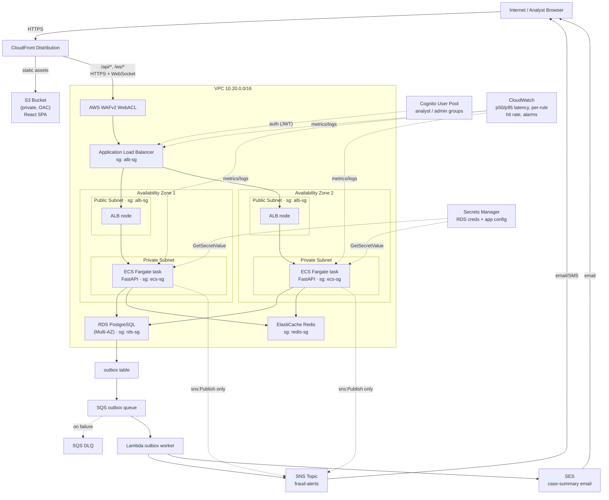

# Oculus AWS Architecture

Real-time payment fraud decision and review platform. Single region
`ap-south-1`, 2 Availability Zones, no cross-region components.

## Diagram

## Security boundaries

- **VPC**: single VPC `10.20.0.0/16`, 2 AZs (`ap-south-1a`, `ap-south-1b`).
- **Public subnets** (one per AZ): host the ALB only. `map_public_ip_on_launch
  = true`. Route to an Internet Gateway.
- **Private subnets** (one per AZ): host ECS Fargate tasks, RDS PostgreSQL,
  and ElastiCache Redis. No public IPs. Route to NAT Gateways (one per AZ)
  for outbound-only internet access (image pulls, AWS API calls).
- **Security groups** (trust boundaries shown in the diagram):
  - `alb-sg`: ingress 80/443 from `0.0.0.0/0` — the only internet-facing SG.
  - `ecs-sg`: ingress on the app port from `alb-sg` only.
  - `rds-sg`: ingress 5432 from `ecs-sg` only.
  - `redis-sg`: ingress 6379 from `ecs-sg` only.
  - `lambda-sg`: egress-only, no inbound (outbox worker talks to AWS APIs,
    not VPC resources).
- **WAF**: WAFv2 WebACL (AWS managed Common + KnownBadInputs rule groups,
  plus per-IP rate limiting) attached to the ALB in front of both REST and
  WebSocket paths.
- **IAM least privilege**: the ECS task role is scoped to `sns:Publish` on
  the fraud-alerts topic ARN only, plus `secretsmanager:GetSecretValue` on
  its own two secrets (via the execution role). The Lambda outbox worker
  role is scoped to `sqs:ReceiveMessage`/`DeleteMessage` on its queue,
  `sns:Publish` on the alerts topic, and `ses:SendEmail`.

## Flow summary

1. Analyst browser loads the React SPA from CloudFront/S3, and calls the
   API / opens a WebSocket through CloudFront -> WAF -> ALB -> ECS Fargate.
2. The stateless FastAPI decision service evaluates each transaction
   through pluggable rules (velocity, amount anomaly, geo-impossibility,
   etc.), using Redis for sliding-window counters and baselines, and
   persists transactions/fraud_flags/reviews plus an outbox row to RDS
   PostgreSQL in the same transaction.
3. A relay drains the `outbox` table into SQS. A Lambda worker consumes
   SQS (failed messages route to the DLQ after 5 receives) and fans out
   alerts via SNS (email/SMS to analysts) and SES (rich case-summary
   email).
4. Cognito issues JWTs for `analyst`/`admin` roles, validated by the ALB
   or the FastAPI service.
5. CloudWatch collects ALB p50/p95 latency, ECS CPU/memory, SQS queue
   depth, and a custom per-rule hit-rate metric (from structured
   `rule_hit` log events), with alarms wired to the SNS topic.
